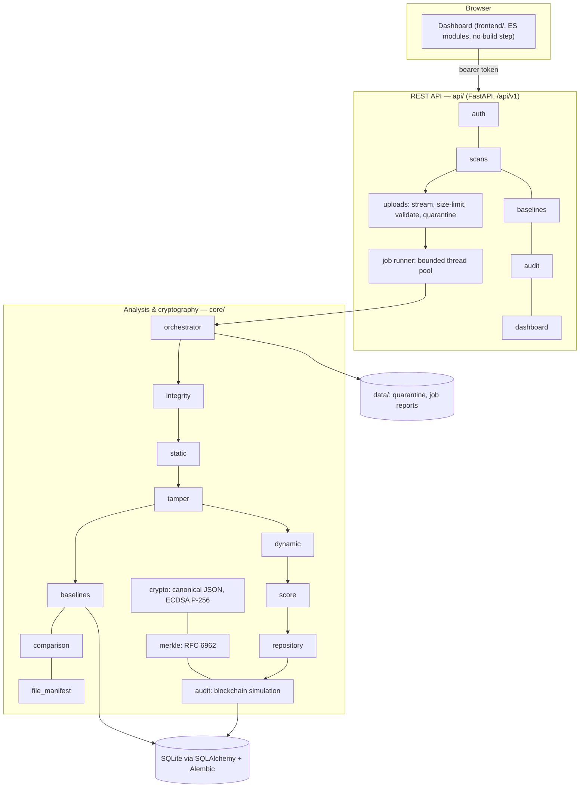
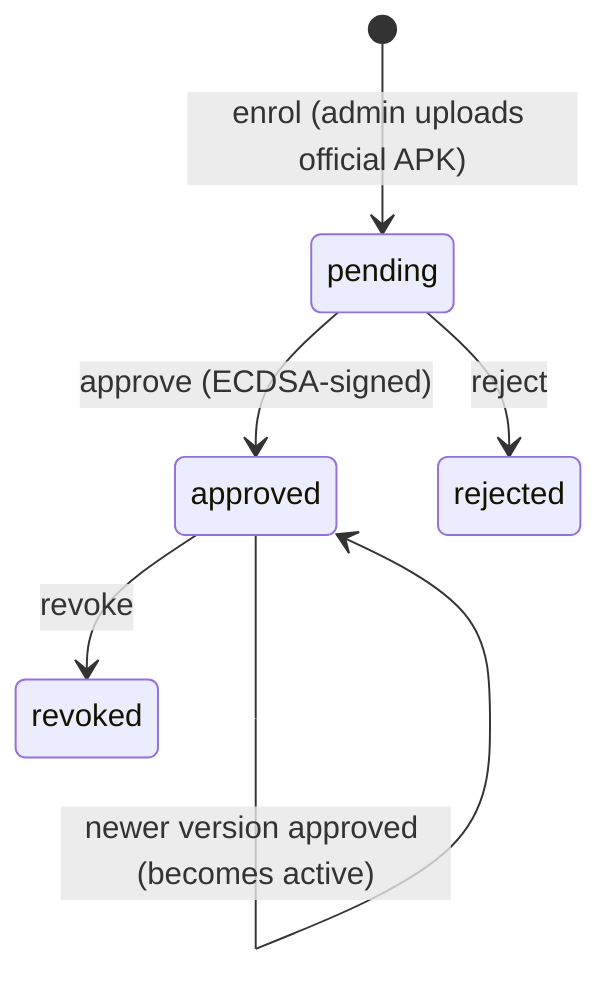
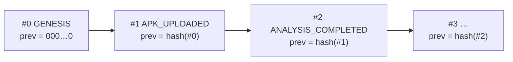
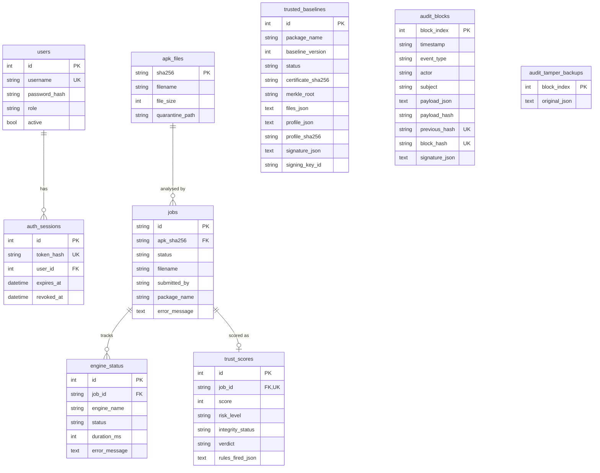

# MerkleTrust — Architecture

MerkleTrust answers one question: **is this Android app the same as its trusted
version, what exactly changed, is it dangerous — and can every answer be proven
later?** This document describes how the code does that. The security reasoning
is in [THREAT_MODEL.md](THREAT_MODEL.md); measured results are in
[../evaluation/README.md](../evaluation/README.md).

## 1. Overview



| Layer | Package | Responsibility |
|---|---|---|
| Presentation | `frontend/` | Plain-language dashboard; technical detail on demand |
| API | `api/` | Authentication, authorisation, uploads, jobs, errors, security headers |
| Analysis | `core/` engines | Parse, verify, compare, score, seal |
| Cryptography | `core/crypto.py`, `core/merkle.py`, `core/audit.py` | Hashing, signatures, Merkle proofs, hash chain |
| Persistence | `db/`, `migrations/` | Models, sessions, schema migrations |
| Tooling | `scripts/` | Fixture/dataset builders, evaluation, benchmark, admin CLIs |

## 2. Analysis pipeline

`core/orchestrator.py::run_job` runs six engines in order. Each engine is a function
`run(job_id, ctx) -> dict` (`core/contracts.py`) that writes `<engine>.json` into the
job workspace. A failing engine is recorded and the pipeline continues; scoring turns
missing core results into **ANALYSIS_FAILED**, never into a safe verdict.

| Stage | Module | Output |
|---|---|---|
| 1. integrity | `core/integrity.py` | Per-file SHA-256 manifest and its Merkle root (authoritative); 64 KB chunk hashes and chunk Merkle root (forensics only); ZIP entry byte spans |
| 2. static | `core/static.py` | Manifest model (AXML), APK signature verification (v1/v2/v3) and certificate, DEX analysis (header checks, sensitive API method references, sensitive base classes, network indicators), native libraries, findings |
| 3. tamper | `core/tamper.py` | Comparison with the package's active approved baseline: integrity status, file changes, certificate/version/profile diff, Merkle proofs for changed files |
| 4. dynamic | `core/dynamic.py` | Optional (off by default) emulator run: install, launch, trigger exported receivers/services, observe processes, sockets, DNS/TLS (packet capture), files, SMS, icon hiding and SELinux denials; RUNTIME_* findings; degrades to `partial` without a device (§2.1) |
| 5. score | `core/scoring.py` | Integrity status, risk score and level, verdict, all findings normalised |
| 6. repository | `core/repository.py` | Seals the canonical hash of all reports into the audit chain |

### 2.1 Dynamic analysis (emulator)

`core/dynamic.py` runs the app in an Android emulator when
`MERKLETRUST_DYNAMIC_ENABLED=true` and a device is connected (set one up with
`scripts/setup_avd.ps1`). It is off by default because it executes the uploaded code.

1. **Gates.** adb found (config, PATH, Android SDK); a ready device; it must be an
   emulator (a physical phone is refused unless `dynamic_allow_physical`); boot
   completed; `adb root` when the image allows it. One analysis at a time per process.
2. **Install** with `-r -g` (all runtime permissions granted, so permission-gated
   behaviour can be seen) after removing leftovers of an earlier run.
3. **Observe.** Start the emulator packet capture (`adb emu network capture`), clear
   logcat, launch the launcher activity (or Frida-spawn it when `MERKLETRUST_FRIDA_PATH`
   is set), send each exported receiver its declared actions (e.g. `BOOT_COMPLETED`)
   and start exported services, then poll `ps` and `/proc/net/{tcp,udp}[6]` filtered by
   the app's UID for the observation window. On a rooted emulator a kprobe on `execve`
   and `sched_process_fork` events are recorded in a private ftrace instance, so every
   program the app *or its descendants* tries to execute is seen, including attempts the
   kernel refuses (e.g. `su` for an unprivileged app), which never become a process.
4. **Collect.** Screenshot, logcat (crashes, SELinux denials, `su` attempts), files in the
   app's storage, new rows in the SMS sent box, disabled launcher activity, runtime
   permissions; the capture is decoded by `core/pcap.py` (DNS, TLS SNI, HTTP Host,
   flows) to name the app's connections. The app is uninstalled afterwards.
   The time budget reserves the observation window and collection; a window cut short
   by a slow emulator is reported (DYN_013) and the run marked `partial`.
5. **Findings.** Behaviour becomes RUNTIME_* findings that share a group with the
   matching static capability (`RUNTIME_CMD_EXEC` / `STATIC_CMD_EXEC` →
   `command_execution`), so "can" and "did" count once. `RUNTIME_PRIV_ESC` (su) has its
   own group. Problems running the analysis are DYN_* findings with 0 points.

Untrusted values from the APK (package, component and action names) are validated
against Android's naming rules and shell-quoted before any `adb shell` command, and are
emitted as JSON string literals in the generated Frida script. Every adb call is
time-boxed and the stage respects `dynamic_timeout_s`.

### 2.2 Parsing untrusted APKs

* **`core/apk_archive.py`** validates every archive before anything reads it: size,
  entry count, total and per-entry uncompressed size, compression ratio (zip bombs),
  unsafe raw entry names (absolute, `..`, backslash, drive letters, NUL — checked on the
  *raw* central-directory name because `zipfile` normalises names), duplicate entries,
  encrypted entries, required `AndroidManifest.xml`, and data before the first entry.
  Reads are capped regardless of declared sizes.
* **`core/axml.py`** parses compiled binary XML; attribute names are resolved through
  the resource-ID map so obfuscated name strings do not defeat it.
* **`core/dex.py`** parses the DEX header and ID tables, verifies the Adler-32 checksum
  and SHA-1 signature, and detects sensitive APIs by *method reference*
  (class + method), falling back to a clearly labelled weak string match only for
  unparseable data.
* **`core/apk_signature.py`** + **`core/der.py`** verify APK Signature Scheme v2/v3
  (signed-data signature, public key ↔ certificate, chunked content digest) and v1 JAR
  signing (entry digests, `.SF` digests, PKCS#7 signature), detect v2 stripping, and
  apply the targetSdk ≥ 30 v2 requirement. Verdicts agree with Google's `apksigner` on
  13/13 genuine and tampered cases (`scripts/crosscheck_apksigner.py`).

### 2.3 Universal content (images, media, web pages, documents)

The pipeline also accepts non-APK content. `core/detector.py::detect_content_type`
classifies the file by **magic bytes**, never by extension (PNG, JPEG, GIF, WebP,
MP4/M4A, Matroska/WebM, WAV, MP3, PDF, HTML; JavaScript is the one text format that
needs its extension as a tie-breaker). An unrecognised file takes the APK path and is
rejected there as before; every ZIP is handed to the APK engine.

For content, the orchestrator runs integrity → content → score → repository and
records `static`, `tamper` and `dynamic` as `skipped`:

| Stage | Module | Output |
|---|---|---|
| integrity | `core/integrity.py::compute_content_integrity` | 64 KB chunk hashes and their RFC 6962 chunk Merkle root (the primary commitment here), whole-file SHA-256, a one-entry manifest so `merkle_root` keeps its schema, `mime_type`, `file_category` |
| content | `core/analyzers/` (`image.py`, `media.py`, `web.py`, `document.py`) | `content.json`: structural findings — appended payloads after the format's real end (JPEG EOI, PNG IEND, GIF trailer, RIFF length, last MP4 atom / Matroska element / MPEG frame, final `%%EOF`), PNG CRC and truncation errors, EXIF GPS and serial numbers, unknown container boxes, missing SRI, `eval`/`document.write`/`innerHTML` sinks, cleartext or off-domain form actions, PDF JavaScript/launch/auto-actions/embedded files |
| score | `core/scoring.py` | Same rules and catalogue; integrity status `NOT_APPLICABLE` (no baseline), so the verdict is HIGH_RISK, REVIEW or CLEAN |
| repository | `core/repository.py` | Seals the reports; the block payload adds `file_category`, `mime_type` and `chunk_merkle_root` |

All parsers are pure Python (`struct`, `zlib`, `wave`, `html.parser`) and walk each
format's declared structure rather than searching for end markers, because those bytes
legitimately occur inside compressed data and EXIF thumbnails. Appended bytes that start
with a known archive/executable/script signature raise the finding to critical.
`JobContext` gains `target_path` (an alias kept in sync with `apk_path`), `mime_type`
and `file_category` (default `"apk"`, so existing callers are unchanged). Baselines
remain APK-only.

## 3. Trusted baselines



* Enrolment (`core/baselines.py::BaselineService.enroll`) accepts only APKs whose own
  signature verifies, stores the file manifest, Merkle root, chunk hashes and a
  time-independent *profile* (permissions, components, flags, certificate, sensitive
  APIs, URLs), and returns a review against the currently active baseline
  (e.g. CERTIFICATE_CHANGED warns of a possible poisoned baseline).
* Approval signs this canonical payload:
  `type, baseline_id, package_name, baseline_version, app_version_name/code, apk_sha256,
  apk_size, certificate_sha256, file_count, merkle_root, profile_sha256, chunk_size,
  chunk_hashes_sha256, created_by/at, approved_by/at, approval_note`.
* The **active** baseline of a package is its approved baseline with the highest
  `baseline_version`. Before every use it is re-verified (`verify_baseline`):
  status approved and consistent with the audit chain, Merkle root recomputed from the
  stored file list, profile hash, and ECDSA signature. A failure yields
  **BASELINE_INVALID** and the baseline is not used.
* Every lifecycle change appends an audit event in the same transaction.

## 4. Integrity versus risk

These are separate questions with separate answers (`core/comparison.py`, `core/scoring.py`).

**Integrity status** — "is it the same app as the trusted version?"

| Status | Meaning |
|---|---|
| CLEAN | Every content file matches the baseline and the app's signature is valid (re-signing with the *same* certificate changes only signature files and stays CLEAN) |
| MODIFIED | Files differ, or the app's own signature is not valid |
| CERTIFICATE_CHANGED | Signed by a different certificate (or unsigned) — by fingerprint, not name |
| NO_BASELINE | No approved baseline for the package |
| BASELINE_INVALID | The stored baseline failed verification |

**Risk** — "does it have dangerous characteristics?" Every finding comes from one
catalogue (`core/findings.py`, 74 entries) with a plain title, technical title,
severity, explanation, recommendation, points and a *group*. The score is the sum of
the highest-scoring finding per group (no double counting), capped at 100.
Level: LOW < 20 ≤ MEDIUM < 45 ≤ HIGH < 70 ≤ CRITICAL; a critical-severity finding
raises the level to at least HIGH. Behaviour-pattern rules recognise capability
combinations (dropper, SMS fraud, spyware). A change signed by the baseline's own key
with a valid signature is treated as the developer's update: it is reported, and its
risk comes only from what it adds. The score is a heuristic indicator, not a
probability of malware.

**Verdict** — one headline, fixed precedence: ANALYSIS_FAILED > HIGH_RISK >
CHANGES_DETECTED > NO_BASELINE > REVIEW > CLEAN.

## 5. Cryptographic design

| Element | Construction | Module |
|---|---|---|
| Canonical encoding | JSON, sorted keys, no whitespace, ASCII-escaped, NaN/Infinity and non-string keys rejected | `core/crypto.py::canonical_json` |
| Hash | SHA-256 everywhere | — |
| Signatures | ECDSA P-256 / SHA-256 over canonical JSON; envelope `{alg: "ECDSA-P256-SHA256", key_id, signature}`; DER Base64; low-S enforced (high-S rejected) | `core/crypto.py` |
| Key id | `"mt-" + SHA-256(SubjectPublicKeyInfo)[:16 hex]` — bound to the key itself | `core/crypto.py::key_id_for` |
| Key management | PEM path from config (optionally encrypted); dev key auto-created outside the repo, atomically; production requires an explicit key; retired public keys accepted for verification | `core/crypto.py`, `scripts/generate_signing_key.py` |
| Merkle tree | RFC 6962: leaf `H(0x00‖data)`, node `H(0x01‖L‖R)`, lone node promoted (no duplication), empty root `H("")` | `core/merkle.py` |
| File leaf | `"merkletrust.file.v1" ‖ 0x00 ‖ utf8(path) ‖ 0x00 ‖ sha256(content)`, sorted by path | `core/file_manifest.py` |
| Audit block | header `{chain, index, timestamp, event_type, actor, subject, payload_hash, previous_hash}`; `block_hash = SHA-256(canonical(header))`; header ECDSA-signed | `core/audit.py` |
| Report seal | `report_sha256 = SHA-256(canonical(engine reports))` stored in an ANALYSIS_COMPLETED block | `core/repository.py` |

### 5.1 Cryptographically Linked Blockchain Simulation



A single-node, append-only chain in the `audit_blocks` table. Changing block *n*
changes its hash (or breaks its signature if the hash is recomputed), and block
*n + 1*'s `previous_hash` no longer matches. `verify_chain` checks index, link,
payload hash, block hash and signature for every block and explains the first break;
given a previously saved **signed head** it also detects deletion of the newest
blocks. `UNIQUE(previous_hash)` makes forks impossible; appends are serialised
in-process and retried across processes. A Merkle root over all block hashes gives
logarithmic inclusion proofs. **There is no network, consensus, mining or
decentralisation** — the UI and API say so.

Events: GENESIS, APK_UPLOADED, ANALYSIS_COMPLETED, INTEGRITY_ALERT,
BASELINE_ENROLLED/APPROVED/REJECTED/REVOKED, REPORT_VERIFIED, CHAIN_VERIFIED,
USER_LOGIN, LOGIN_FAILED, AUDIT_TAMPER_DEMO, AUDIT_RESTORED.

## 6. Database design

SQLite (WAL, `synchronous=FULL`, foreign keys on), SQLAlchemy 2, Alembic migrations
(`migrations/versions/0001_initial_schema.py`). A database created before migrations
is refused at startup with instructions.



Constraints worth noting: `uq_baseline_package_version`, status check constraints on
baselines, jobs and users, `UNIQUE(previous_hash)` and `UNIQUE(block_hash)` on audit
blocks, `ON DELETE CASCADE` from jobs and users to their children. Full reports are
stored as files (`data/jobs/<id>/merged.json`); their integrity is protected by the
sealed hash, not by the file system. `audit_tamper_backups` exists only for the
tamper demonstration.

## 7. API design

Versioned under `/api/v1`, JSON, bearer-token authentication. Errors always have the
form `{"error": {"code", "message", "request_id"}}` (validation errors add `details`
without echoing input). Interactive docs at `/api/docs` outside production.

| Method | Path | Access | Purpose |
|---|---|---|---|
| POST | `/api/v1/auth/login` | public, rate-limited | Sign in; returns a bearer token |
| POST | `/api/v1/auth/logout` | user | Revoke the current session |
| GET | `/api/v1/auth/me` | user | Current user and role |
| POST | `/api/v1/scans` | user, rate-limited | Upload an APK, image, audio/video, web page or PDF (202 + scan id) |
| GET | `/api/v1/scans` | user | Scan history (paginated, filter by package) |
| GET | `/api/v1/scans/{scan_id}` | user | Status, engine progress, result summary |
| GET | `/api/v1/scans/{scan_id}/report` | user | Full engine reports |
| POST | `/api/v1/scans/{scan_id}/verify` | user | Prove the report matches its sealed hash in an intact chain (recorded) |
| GET | `/api/v1/scans/{scan_id}/files/proof` | user | Merkle proof of one file against the baseline root |
| GET | `/api/v1/scans/{scan_id}/bundle` | user | Export self-contained verification bundle for zero-trust offline verification |
| GET | `/api/v1/scans/{scan_id}/attestation` | user | Export signed in-toto Statement v1 with SLSA Provenance v1.0 predicate |
| GET | `/api/v1/baselines` | user | List baselines (filter by package / status) |
| POST | `/api/v1/baselines` | admin | Enrol an official APK (pending) + review |
| GET | `/api/v1/baselines/{baseline_id}` | user | Baseline details (optionally files + profile) |
| POST | `/api/v1/baselines/{baseline_id}/approve` | admin | Approve and sign |
| POST | `/api/v1/baselines/{baseline_id}/reject` | admin | Reject a pending baseline |
| POST | `/api/v1/baselines/{baseline_id}/revoke` | admin | Revoke an approved baseline |
| GET | `/api/v1/baselines/{baseline_id}/verify` | user | Re-verify the stored record |
| GET | `/api/v1/baselines/{baseline_id}/files/proof` | user | Merkle proof of a file in the baseline |
| GET | `/api/v1/audit/blocks` | user | Blocks (newest first) with per-block verification |
| GET | `/api/v1/audit/blocks/{index}` | user | One block |
| GET | `/api/v1/audit/blocks/{index}/proof` | user | Merkle inclusion proof of a block |
| POST | `/api/v1/audit/verify` | user | Verify the chain (optionally against a saved head; recorded if valid) |
| GET | `/api/v1/audit/head` | user | Signed statement of the current head |
| GET | `/api/v1/audit/keys` | user | Public verification keys |
| POST | `/api/v1/audit/demo/tamper` | admin, demo only | Alter a stored block (demonstration) |
| POST | `/api/v1/audit/demo/restore` | admin, demo only | Undo the demonstration |
| GET | `/api/v1/dashboard/summary` | user | Dashboard figures and recent events |
| GET | `/api/v1/health` | public | Liveness |

Cross-cutting (`api/main.py`): request ids, JSON access log, security headers
(CSP `script-src 'self'`, `X-Frame-Options: DENY`, `nosniff`, `Referrer-Policy`,
`Permissions-Policy`, COOP, `Cache-Control: no-store` for the API), CORS allow-list
without credentials (closed by default), request-body limit enforced while
streaming, generic 500s. Authentication (`api/security.py`): scrypt password hashes,
random 256-bit session tokens of which only SHA-256 is stored, expiry and revocation.
Uploads (`api/uploads.py`): streamed with a size cap, `.apk` only, full archive
validation, sanitised display name, stored read-only under their SHA-256. Jobs
(`api/jobs.py`): bounded thread pool, HTTP 503 when the queue is full, interrupted
jobs marked failed at startup.

## 8. Frontend

`frontend/index.html` loads `js/app.js` (hash router) and page modules in
`js/pages/`: login, dashboard, scan, scans, result (tabs: Overview, File changes,
Security findings, Certificate, Verification, Technical details), baselines, audit,
chain. `js/dom.js` builds every element with `textContent`/`setAttribute` — data from
APKs is never inserted as HTML. `js/api.js` keeps the session token in
`sessionStorage` (this tab only). Status is always shown with an icon and words, not
colour alone. `tests/e2e/ui_smoke.mjs` drives every page in headless Chrome.

## 9. Configuration

All settings are environment variables with the `MERKLETRUST_` prefix (or `.env`), see
`core/config.py` and `.env.example`: environment, data directory, database URL,
signing key path/password, trusted keys directory, CORS origins, upload size, session
lifetime, job workers/queue size, demo endpoints, migrations, logging, rate limits, and
the dynamic-analysis switch, time budget, observation window, adb path/serial and Frida path.
No secret has a default value.

## 10. Repository layout

```
api/            REST API (main.py, routers/, security, uploads, jobs, errors, rate limiting)
core/           engines and cryptography
db/             models, sessions, migration helper
migrations/     Alembic environment and revisions
frontend/       dashboard (HTML, CSS, ES modules)
scripts/        builders, evaluation, benchmark, CLIs, cross-checks
tests/          pytest suite (+ fixtures/apks, e2e/)
evaluation/     dataset, results, methodology
docs/           this document, threat model, report, testing, demo, viva
```
