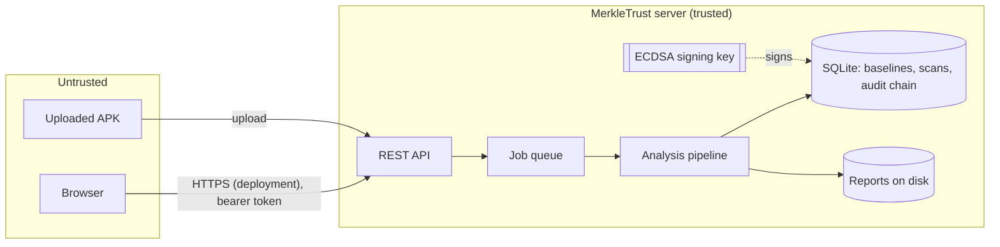

# MerkleTrust — Threat Model

This document states what MerkleTrust protects, against whom, under which
assumptions, and — for every threat — how it is detected and defended. Each
defence names the code that implements it and the tests/evaluation cases that
demonstrate it.

## 1. System and assets

| Asset | Why it matters |
|---|---|
| **Trusted baselines** | Every integrity verdict is relative to them; a poisoned baseline makes a tampered app look clean. |
| **Analysis reports** | What users act on; a forged report could clear a malicious app. |
| **Audit chain** | The tamper-evident history of uploads, approvals, verdicts and verifications. |
| **Signing key** (ECDSA P-256) | Signs baselines and audit blocks; whoever holds it can forge both. |
| **User accounts / sessions** | Admins can approve baselines; analysts can upload. |
| **The server itself** | Parses hostile files; must not crash, leak data or execute attacker input. |

Trust boundaries: (1) uploaded APK bytes → parser, (2) browser → API, (3) API →
database/files, (4) anyone with database or file-system access → stored data.

## 2. Attacker model

| Attacker | Capabilities | Does **not** control |
|---|---|---|
| **A1 — App tamperer / repackager** | Obtains an official APK; modifies any byte (DEX, manifest, resources, native code, signature files); adds or deletes files; re-signs with **their own** key, possibly with a look-alike certificate (same subject name); strips signatures; prepends data. | The developer's private signing key. |
| **A2 — Malicious-app author** | Publishes an app with dangerous behaviour (code loading, SMS fraud, spyware, command execution). | — (no baseline exists for their app) |
| **A3 — Hostile uploader** | Uploads crafted files: non-APKs, zip bombs, path-traversal names, duplicate entries, oversized bodies, hostile strings in names/URLs. | Valid credentials of other users. |
| **A4 — Insider with storage access** | Reads and writes the database and report files directly: edits baselines, reports, audit blocks, statuses; deletes rows. | The audit/baseline **signing key**; the running server process. |
| **A5 — Network / web attacker** | Sends arbitrary HTTP requests, guesses passwords, tries cross-origin requests from a malicious site. | A logged-in user's bearer token (not stored in cookies). |

**Assumptions** (outside the protection of this prototype):

* The administrator who approves a baseline is honest and approves the genuine build
  (the system *warns* about signer changes but cannot know the developer's intent).
* The signing key is not stolen. In the prototype it is a PEM file (optionally
  password-encrypted) outside the repository; production should use an HSM/KMS.
* The server host and Python runtime are not compromised.
* TLS terminates in front of the server in a real deployment (the demo uses plain HTTP on localhost).

## 3. Threat → attack → detection → defence

| # | Threat | Attack (attacker) | Detection | Defence / where | Evidence |
|---|---|---|---|---|---|
| T1 | APK modified | Change any file content (A1) | Per-file SHA-256 differs from the signed baseline manifest; app signature no longer verifies | `core/file_manifest.py`, `core/apk_signature.py`, `core/comparison.py` | eval D04–D11, N04; `test_tamper_engine.py` |
| T2 | DEX (code) modified | Patch or rebuild `classes.dex` (A1) | `classes.dex` reported **modified**; DEX header checksum/SHA-1 mismatch if patched by hand; Merkle proof of the uploaded hash fails against the trusted root | `core/dex.py`, `core/tamper.py` | eval D05, N04; `test_modified_dex_detected_with_merkle_proof` |
| T3 | Manifest modified | Add permissions/components, enable debuggable (A1) | `AndroidManifest.xml` modified + profile diff (permissions/components/flags added) | `core/axml.py`, `core/comparison.py` | eval D04, D10, W03; `test_manifest_modification` |
| T4 | File injection / deletion | Add `assets/payload.bin`, remove a file (A1) | Reported as **added** / **deleted**; v1 signature reports unsigned/missing entries | `core/file_manifest.py`, `core/apk_signature.py` | eval D07, D08; `test_v1_injected_file_detected` |
| T5 | Repackaging / certificate replacement | Re-sign with own key, incl. look-alike subject (A1) | Certificate **fingerprint** differs from the baseline → CERTIFICATE_CHANGED (subject names are not trusted) | `core/comparison.py` | eval D06, D09, N03 (key B copies the subject) |
| T6 | Signature stripping / downgrade | Remove v2 block to fall back to v1 (A1) | v1 `.SF` declares `X-Android-APK-Signed: 2` but no v2 block → invalid; targetSdk ≥ 30 requires v2 | `core/apk_signature.py` | eval D12; `test_v2_signature_stripping_detected`; 13/13 agreement with `apksigner` |
| T7 | Janus-style prepended data | Prepend a DEX to a signed APK (A1) | Bytes before the first ZIP entry reported; signature invalid | `core/apk_archive.py` | eval D13; `test_prepended_data_flagged` |
| T8 | Dangerous app behaviour | Code loading, SMS fraud, spyware, command execution (A2) | Catalogued findings + behaviour-pattern rules raise risk to HIGH/CRITICAL; optionally, behaviour observed in an emulator (RUNTIME_* findings) | `core/static.py`, `core/dynamic.py`, `core/findings.py`, `core/scoring.py` | eval R01–R04 (dev), H01–H07 (held-out: 1 FP, 1 FN) |
| T9 | Baseline poisoning | Get a tampered build approved as trusted (A1/A4) | Explicit admin approval only; enrolment shows a review against the active baseline, flagging CERTIFICATE_CHANGED; only APKs with a valid signature can be enrolled | `core/baselines.py`, UI "Trusted versions" | `test_review_warns_about_certificate_change`, `test_invalid_apks_cannot_be_enrolled` |
| T10 | Stored baseline modified | Edit file hashes, Merkle root, certificate, profile; swap signature (A4) | Re-verified before every use: Merkle root recomputed, profile hash, ECDSA signature over the canonical payload; unusable → BASELINE_INVALID | `core/baselines.py::verify_baseline` | eval K05–K08; `test_tampered_*` in `test_baselines.py` |
| T11 | Revocation rolled back | Flip `revoked` back to `approved` in the DB (A4) | Status cross-checked against the signed audit chain | `core/baselines.py::audit_status` | eval K09; `test_undoing_a_revocation_in_the_database_is_detected` |
| T12 | Stored report modified | Edit `merged.json` (verdict, hashes) (A4) | Canonical SHA-256 of the reports no longer matches the hash sealed in the signed audit block | `core/repository.py::verify_job_report` | eval K03–K04; `test_modified_report_detected` |
| T13 | Audit block modified | Edit event data; or edit and recompute the block hash (A4) | Payload hash mismatch; signature invalid; next block's `previous_hash` no longer links | `core/audit.py::verify_chain` | eval K01–K02; `test_audit_chain.py` |
| T14 | Audit history forged with another key | Append blocks signed by a key the attacker controls (A4) | Key id not in the trusted key ring → signature invalid | `core/crypto.py::KeyRing` | eval K10; `test_block_signed_by_untrusted_key_detected` |
| T15 | Audit history truncated | Delete the newest blocks (A4) | Detected against a previously saved **signed head** (hash linking alone cannot detect tail deletion) | `core/audit.py::signed_head`, `verify_chain(expected_head=…)` | eval K11; `test_truncation_detected_with_saved_head` |
| T16 | Chain fork / lost events | Concurrent writers (or an attacker inserting a sibling block) | `UNIQUE(previous_hash)` and primary key reject a second child; appends serialised and retried | `db/models.py::AuditBlock`, `core/audit.py` | `test_fork_is_impossible`, `scripts/stress_audit_chain.py` |
| T17 | Signature malleability / algorithm confusion | Re-encode a valid ECDSA signature; change `alg`; claim another key id (A4) | Only `ECDSA-P256-SHA256` accepted; high-S signatures rejected; key id is derived from the public key | `core/crypto.py` | `test_signatures_are_low_s_and_high_s_is_rejected`, `test_relabelled_key_id_fails` |
| T18 | Merkle forgery | Second-preimage via internal node as leaf; duplicated last leaf; forged proof (A4) | RFC 6962 domain separation (0x00 leaf / 0x01 node), no duplication; strict proof validation; leaves bind path to hash | `core/merkle.py`, `core/file_manifest.py` | `test_merkle.py` (RFC reference, forged proofs) |
| T19 | Malformed / malicious upload | Non-APK, zip bomb, `../` names, NUL/backslash names, duplicate entries, huge body (A3) | Hardened archive validation before any analysis; body size enforced while streaming; filename never used as a path | `core/apk_archive.py`, `api/uploads.py`, `api/main.py::BodySizeLimit` | `test_apk_archive.py`, `test_bad_uploads_rejected`, `test_oversized_upload_rejected` |
| T20 | Parser crash / DoS | Truncated or fuzzed manifest, DEX, DER (A3) | Parsers raise typed errors, never crash; queue bounded (HTTP 503) | `core/axml.py`, `core/dex.py`, `core/der.py`, `api/jobs.py` | fuzz tests; `test_queue_full_returns_503` |
| T21 | Code injection via APK strings | Hostile URLs/class names into the generated Frida script (A3) | — | Values emitted as JSON string literals | `test_frida_script_is_not_injectable` |
| T22 | XSS via APK strings | Package names, paths, subjects rendered in the dashboard (A3) | — | DOM built with `textContent` only; strict CSP (`script-src 'self'`, no inline) | `test_frontend_never_injects_html`, `test_dashboard_is_served_with_strict_csp` |
| T23 | Unauthorised actions | Unauthenticated calls; analyst approving baselines (A5) | 401 / 403 | Bearer sessions, roles (`api/deps.py`) | `test_endpoints_require_authentication`, `test_analyst_cannot_perform_admin_actions` |
| T24 | Credential attacks | Password guessing; stolen database (A5/A4) | Rate limit 429; failed logins audited | scrypt hashes; only SHA-256 of session tokens stored; constant-time compare | `test_login_rate_limited`, `test_secrets_are_not_stored_in_clear` |
| T25 | Cross-site requests | Malicious site calling the API (A5) | — | Tokens not in cookies; CORS closed by default, allow-list without credentials | `test_cors_*` |
| T26 | Information leakage | Trigger errors to read stack traces / internals (A5) | — | One JSON error format, generic 500, request id for correlation | `test_internal_errors_are_generic`, `test_validation_errors_do_not_echo_input` |
| T27 | Analysis runs hostile code | The uploaded app executes in the emulator; hostile package/component/action names reach `adb shell` (A2/A3) | — | Off by default; emulators only (physical devices refused); names validated against Android naming rules and shell-quoted; app uninstalled after the run; every adb call time-boxed; one run at a time | `test_disabled_by_default`, `test_physical_device_is_refused`, `test_hostile_names_never_reach_the_device_shell` |

## 4. Residual risks (stated honestly)

| Risk | Why it remains | Mitigation outside the prototype |
|---|---|---|
| Stolen signing key | Whoever holds it can sign forged baselines and blocks. | HSM / cloud KMS; key rotation is supported (`MERKLETRUST_TRUSTED_KEYS_DIR`). |
| Insider deletes the whole chain or rewrites it **and** holds the key | A single-node simulation has no independent witnesses. | Publish signed heads externally (e.g. to a transparency log or another party). |
| Truncation without a saved head | Hash links cannot reveal missing *newest* blocks. | Periodically store `GET /api/v1/audit/head` outside the server. |
| Malicious admin approves a bad baseline | The system warns but cannot know intent. | Two-person approval (not implemented). |
| Static analysis limits | Cannot see intent (benign plugin loading looks like a dropper) or code downloaded later; no static rule for privilege-escalation commands. | The optional emulator engine observes behaviour (e.g. `su` attempts); more rules; human review. |
| Dynamic analysis limits | A short unattended run only sees behaviour that is triggered; apps can detect emulators and stay quiet; code downloaded from a server that is offline never runs. Nothing observed is not proof of safety. | Longer runs, UI exercisers, anti-evasion emulator images, human review. |
| Emulator containment | The analysed app runs with the emulator's internet access and could reach real servers; an emulator escape would reach the analysis host. | Run the emulator on an isolated host or network segment with filtered egress. |
| Denial of service at scale | In-process rate limiter, single SQLite file. | Shared rate-limit store, PostgreSQL, reverse proxy limits. |
| Transport security | Demo runs over HTTP. | TLS + HSTS in deployment. |
